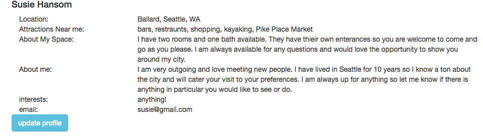

#City Guides
Travel to a new city and live like a local.  With this app you can find a great place to stay with a host that is excited to show you around the city.  

<a href="https://city-guides.herokuapp.com/#/authenticate">Link to app on Heroku</a>

####Homepage

####Host Sign Up

####Guest Sign Up

####Search View

####Profile View

####Installation
To begin fork the link for this repo and git clone it in your terminal in the location you'd like the file to be stored.

Navigate to the folder in your repo and run NPM install

Start mongod or sudo mongod in one terminal, enter your password if prompted

Start nodemon in another terminal
(note: both mongod/sudo mongod and nodemon must be running to run the app)

####Approach
I began this project by working through the trello board and doing my best to document everything that needed to be created.  To begin coding I started with the back end working on each route and testing them with Postman to ensure they were working propely.  I then started working through the front end routes and creating a partial for each view, also testing along the way.  I then began implementing features and will continue to add the necessary features to make this app useable.  

####Technologies

* HTML
* Node.js
* Angular
* MongoDB
* Express
* Passport
* Bcrypt 
* Body-parser
* Cookie-parser
* Mongoose
* Path
* Bootstrap

####Additional Features to be Added

* Calendar to add and search by date for available places to stay
* Map to see where each place is located 

####Unsolved Problems

* The search feature does not always work when searching through other data besides the cities

